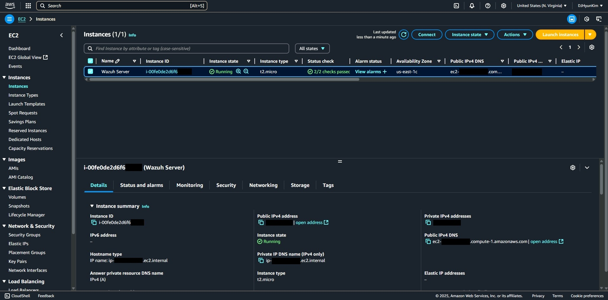
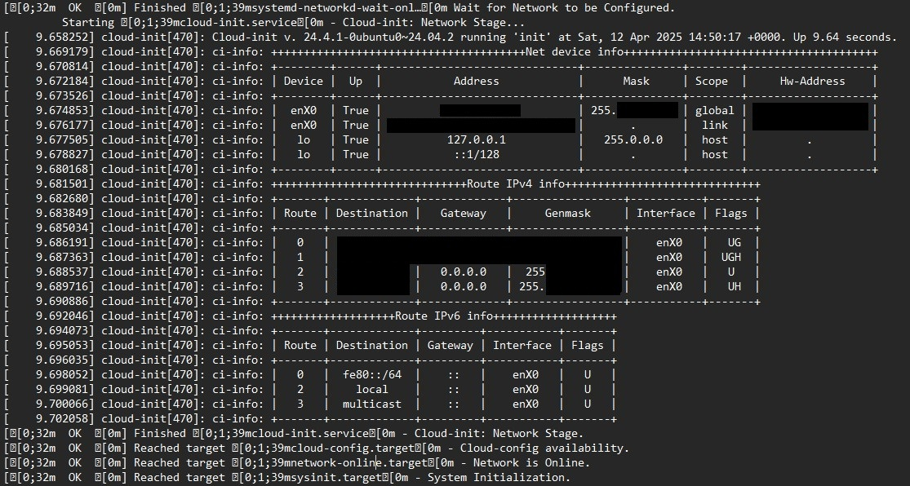
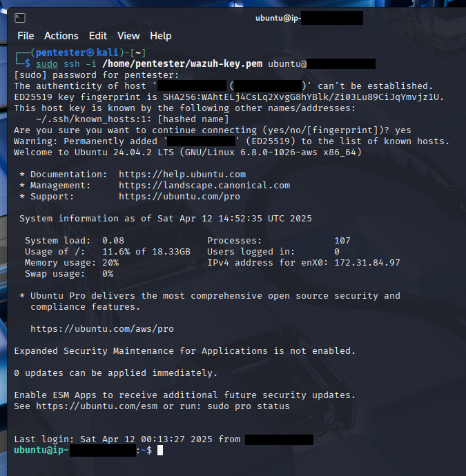
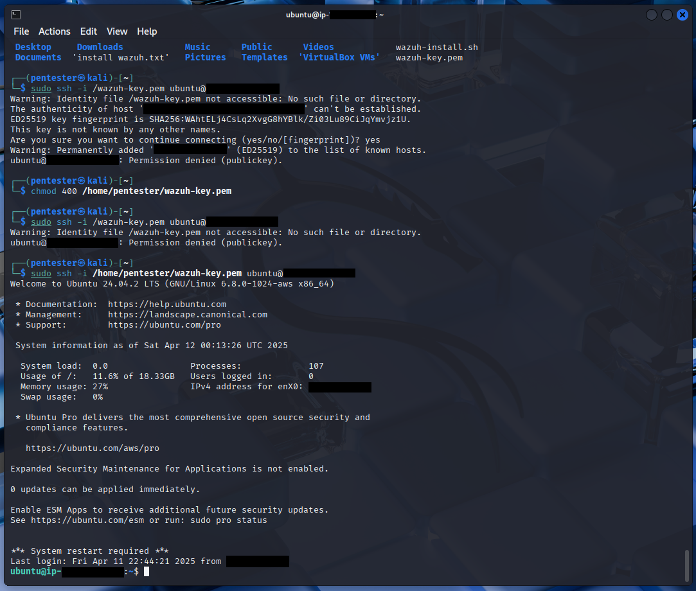
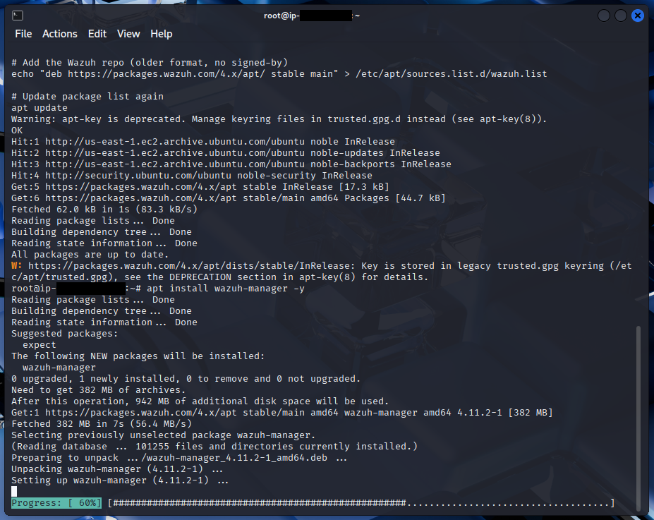
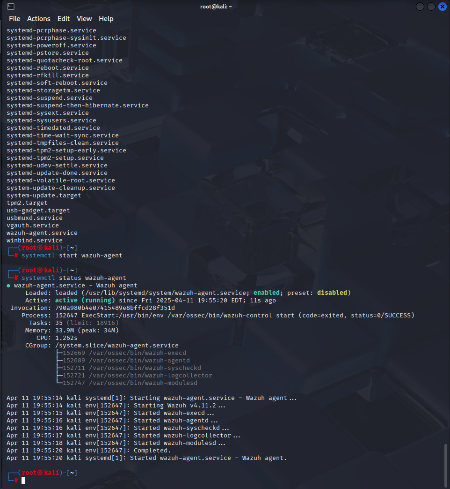

# 🛡️ Wazuh SIEM on AWS EC2

### Introduction
This project documents the installation of Wazuh Security Information and Event Management (SIEM) on AWS EC2 instance. It provides a hands-on approach to building a cloud-based SIEM environment, enabling real-time log monitoring, intrusion detection, and threat visualization.

---

## Project Goals
- Deploy and configure Wazuh SIEM on AWS EC2  
- Enable host-based intrusion detection and real-time log monitoring  
- Learn basic cloud setup and security group configurations  
- Gain hands-on experience managing a SIEM environment

---

### AWS EC2 Instance Setup
Successfully initiated an EC2 Instance on AWS

---

### Network Configuration
Configure your security groups and firewall rules to allow access to the EC2 instance. At minimum:  

---

### Connecting to EC2 via Kali Linux
Use your local system (Kali Linux in this example) to establish an SSH connection to the EC2 instance.

---

### Remoting into EC2
Once connected, you can perform administrative tasks and prepare the system for Wazuh installation.

---

### Installing Wazuh SIEM in EC2 Instance
Install Wazuh using either the official installation script or manual setup for the Manager, API, and Web Interface

---

### Verifying Wazuh Status
Ensure Wazuh services are running correctly.

---

## Outcomes
- Successfully deployed a fully functional Wazuh SIEM system on AWS EC2
- Gained hands-on experience with cloud-based SIEM management
- Practiced managing SSH access and security groups

---

## Lessons Learned
- Properly configuring AWS security groups is critical to both security and accessibility
- Successful installation of the Wazuh agent
- Cloud-based SIEM labs provide realistic intrusion detection experience
- Documenting processes helps with repeatable deployments

---

## References
- [Wazuh Documentation](https://documentation.wazuh.com/)
- [AWS EC2 Guide](https://aws.amazon.com/ec2/)
- [OpenSSH Documentation](https://www.openssh.com/manual.html)
